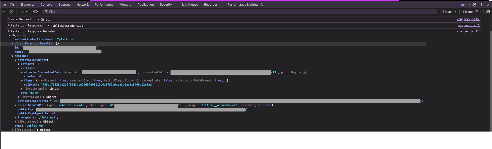

# WebAuthn Debugger
This is a WebAuthn API wrapper built to provide developers visablity into WebAuthn API invokations

# Installation
Clone the repository and install as a browser extension

# Usage
Go to any web site invoking the `navigator.credentials.get()` and `navigator.credentials.create()` APIs.
Check your DevTools Console for the DEBUG level logs produced by the extension, you'll gain visablity to the Request and Response objects.
You can also use the Console to interact with the Request/Response objects, type in the Console `WAD.lastCreateRequest`,  `WAD.lastCreateResponse`, `WAD.lastGetRequest` and `WAD.lastGetREsponse`.
You also can use the helper functions `WAD.arrayBufferToBase64` and `WAD.base64ToArrayBuffer` to convert ArrayBuffers to readable text and vice versa.

